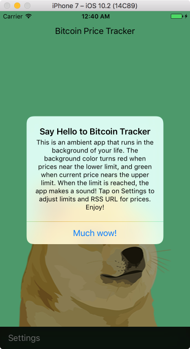
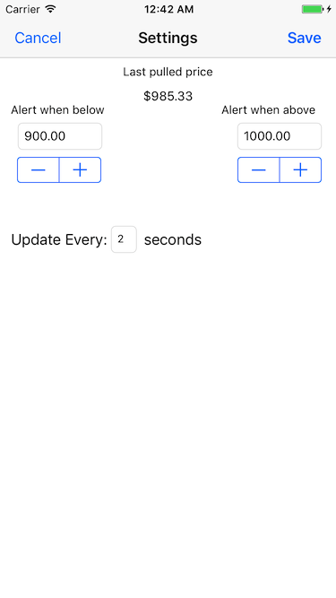

# dogecointracker
An iPhone app that tracks Bitcoin prices, ambiently.

## Installation
Clone the repository to your computer 
```git clone https://github.com/josephyli/bitcoin-price-tracker.git```

## Usage
Open the DogecoinTracker.xcodeproj in Xcode 8.2 or newer. Click Build and Run to launch the app in the iPhone/iPad configuration of choice.

Tap Settings to adjust the minimum and maximum prices alerts and the update frequence.


That's it!
